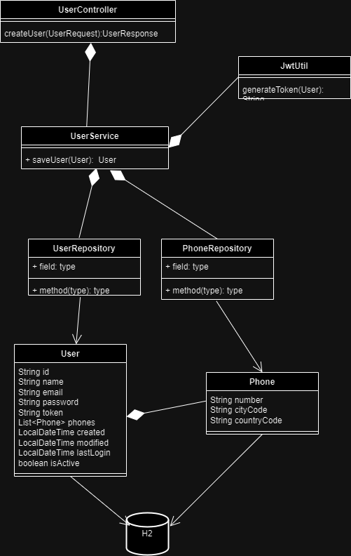

### Create a User (POST /api/user)

Create a new user by sending a POST request to the `/api/user` endpoint.

#### Request

```http
POST /api/user HTTP/1.1
Host: your-api-domain.com
Content-Type: application/json

{
  "name": "John Doe",
  "email": "johndoe@example.com",
  "password": "examplePassword",
  "phones": [
    {
      "number": "123456789",
      "citycode": "1",
      "contrycode": "57"
    }
  ]
}


